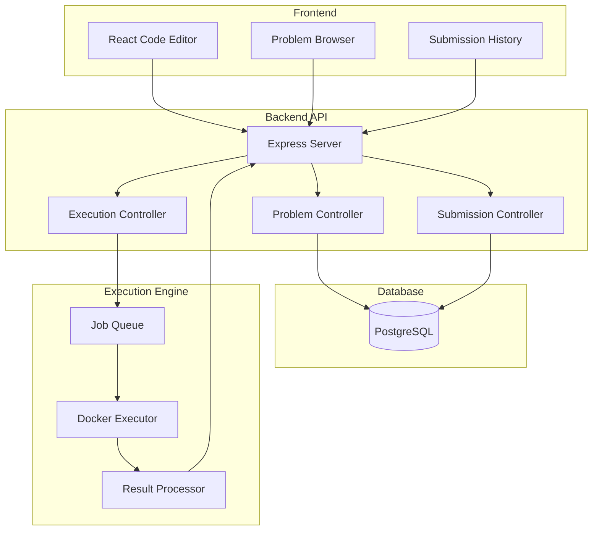
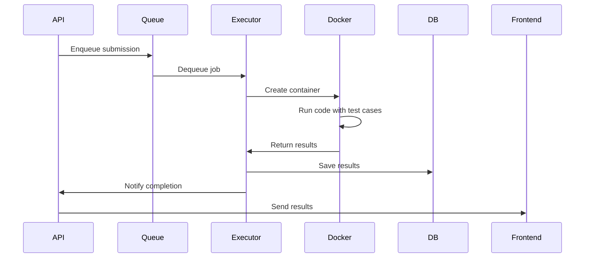

# Design Document: Coding Practice System

## Overview

The Coding Practice System is a full-stack feature that enables students to solve programming problems through a browser-based interface. The system consists of a React-based code editor frontend, a Node.js/Express API backend, and a secure code execution engine that runs student submissions in isolated Docker containers. The architecture follows a microservices pattern where the execution engine is separated from the main application for security and scalability.

Key design principles:
- **Security First**: All code execution happens in isolated sandboxed environments
- **Real-time Feedback**: Students receive immediate feedback on code execution
- **Scalability**: Execution engine can scale independently to handle concurrent submissions
- **Language Agnostic**: Support multiple programming languages through containerized runtimes

## Architecture

### High-Level Architecture



### Component Interaction Flow

1. **Problem Browsing**: Frontend → API → Database → API → Frontend
2. **Code Execution**: Frontend → API → Job Queue → Docker Executor → Result Processor → API → Frontend
3. **Submission**: Frontend → API → Job Queue → Docker Executor → Database → Frontend

## Components and Interfaces

### Frontend Components

#### 1. ProblemBrowser Component
**Purpose**: Display and filter coding problems

**Props**:
```typescript
interface ProblemBrowserProps {
  onProblemSelect: (problemId: string) => void;
}
```

**State**:
```typescript
interface ProblemBrowserState {
  problems: Problem[];
  filters: {
    difficulty: 'Easy' | 'Medium' | 'Hard' | 'All';
    tags: string[];
    searchQuery: string;
  };
  sortBy: 'difficulty' | 'acceptance' | 'title';
  loading: boolean;
}
```

**Key Methods**:
- `fetchProblems()`: Load problems from API
- `applyFilters()`: Filter problems based on current filter state
- `handleSort()`: Sort problems by selected criterion

#### 2. CodeEditor Component
**Purpose**: Provide code editing interface with syntax highlighting

**Props**:
```typescript
interface CodeEditorProps {
  problemId: string;
  language: 'python' | 'javascript' | 'java';
  initialCode: string;
  onRun: (code: string) => void;
  onSubmit: (code: string) => void;
}
```

**State**:
```typescript
interface CodeEditorState {
  code: string;
  language: string;
  isRunning: boolean;
  isSubmitting: boolean;
  testResults: TestResult[];
}
```

**Key Methods**:
- `handleCodeChange()`: Update code state
- `handleLanguageChange()`: Switch programming language
- `runCode()`: Execute code against example test cases
- `submitCode()`: Submit code for full evaluation

#### 3. ProblemDetail Component
**Purpose**: Display problem description, examples, and constraints

**Props**:
```typescript
interface ProblemDetailProps {
  problem: Problem;
}
```

**Renders**:
- Problem title and difficulty badge
- Problem description with formatted text
- Example test cases with input/output
- Constraints and hints (expandable)
- Company tags

#### 4. SubmissionHistory Component
**Purpose**: Display past submissions for a problem

**Props**:
```typescript
interface SubmissionHistoryProps {
  problemId: string;
  userId: string;
}
```

**State**:
```typescript
interface SubmissionHistoryState {
  submissions: Submission[];
  selectedSubmission: Submission | null;
  filterStatus: string;
}
```

### Backend API Endpoints

#### Problem Endpoints

**GET /api/problems**
- Query params: `difficulty`, `tags`, `search`, `sortBy`
- Response: `{ problems: Problem[] }`
- Purpose: Retrieve filtered and sorted problems

**GET /api/problems/:id**
- Response: `{ problem: Problem, testCases: TestCase[] }`
- Purpose: Get detailed problem information

**GET /api/problems/:id/template**
- Query params: `language`
- Response: `{ template: string }`
- Purpose: Get solution template for specific language

#### Execution Endpoints

**POST /api/execute/run**
- Body: `{ problemId, code, language }`
- Response: `{ results: TestResult[], status: string }`
- Purpose: Run code against example test cases only

**POST /api/execute/submit**
- Body: `{ problemId, code, language, userId }`
- Response: `{ submissionId, status, results: TestResult[], metrics: ExecutionMetrics }`
- Purpose: Submit code for full evaluation

**GET /api/execute/status/:submissionId**
- Response: `{ status, progress, results }`
- Purpose: Poll submission status for async execution

#### Submission Endpoints

**GET /api/submissions/user/:userId/problem/:problemId**
- Response: `{ submissions: Submission[] }`
- Purpose: Get submission history for a problem

**GET /api/submissions/:id**
- Response: `{ submission: Submission, code: string, results: TestResult[] }`
- Purpose: Get detailed submission information

**GET /api/submissions/user/:userId/stats**
- Response: `{ totalSolved, byDifficulty, byTopic, acceptanceRate }`
- Purpose: Get user's coding statistics

## Data Models

### Problem Model
```typescript
interface Problem {
  id: string;
  title: string;
  difficulty: 'Easy' | 'Medium' | 'Hard';
  description: string;
  constraints: string[];
  examples: Example[];
  hints: string[];
  tags: string[];
  companies: string[];
  acceptance: number;
  timeLimit: number; // milliseconds
  memoryLimit: number; // MB
  createdAt: Date;
  updatedAt: Date;
}

interface Example {
  input: string;
  output: string;
  explanation?: string;
}
```

### TestCase Model
```typescript
interface TestCase {
  id: string;
  problemId: string;
  input: string;
  expectedOutput: string;
  isExample: boolean; // true for visible test cases
  weight: number; // for weighted scoring
}
```

### Submission Model
```typescript
interface Submission {
  id: string;
  userId: string;
  problemId: string;
  code: string;
  language: string;
  status: 'Accepted' | 'Wrong Answer' | 'Time Limit Exceeded' | 
          'Memory Limit Exceeded' | 'Runtime Error' | 'Compilation Error';
  runtime: number; // milliseconds
  memory: number; // MB
  runtimePercentile: number;
  memoryPercentile: number;
  testsPassed: number;
  totalTests: number;
  submittedAt: Date;
}
```

### ExecutionResult Model
```typescript
interface ExecutionResult {
  testCaseId: string;
  passed: boolean;
  input: string;
  expectedOutput: string;
  actualOutput: string;
  runtime: number;
  memory: number;
  error?: string;
}
```

### SolutionTemplate Model
```typescript
interface SolutionTemplate {
  id: string;
  problemId: string;
  language: string;
  template: string;
  functionSignature: string;
}
```

## Execution Engine Design

### Docker-Based Execution

Each submission runs in an isolated Docker container with:
- **Resource Limits**: CPU, memory, and time constraints
- **Network Isolation**: No network access
- **Filesystem Isolation**: Read-only filesystem except /tmp
- **Process Isolation**: Single process per container

### Execution Flow



### Language Runtime Containers

**Python Container**:
```dockerfile
FROM python:3.11-alpine
RUN adduser -D -u 1000 runner
USER runner
WORKDIR /code
CMD ["python", "solution.py"]
```

**JavaScript Container**:
```dockerfile
FROM node:18-alpine
RUN adduser -D -u 1000 runner
USER runner
WORKDIR /code
CMD ["node", "solution.js"]
```

**Java Container**:
```dockerfile
FROM openjdk:17-alpine
RUN adduser -D -u 1000 runner
USER runner
WORKDIR /code
CMD ["java", "Solution"]
```

### Security Measures

1. **Container Isolation**: Each execution runs in a fresh container
2. **Resource Limits**: 
   - CPU: 1 core max
   - Memory: 256MB max
   - Time: Problem-specific (typically 2-10 seconds)
3. **No Network Access**: Containers have no network connectivity
4. **Read-Only Filesystem**: Code cannot write to disk except /tmp
5. **User Permissions**: Code runs as non-root user
6. **Automatic Cleanup**: Containers are destroyed after execution

## Test Case Execution Strategy

### Test Case Types

1. **Example Test Cases**: Visible to students, used for "Run Code"
2. **Basic Test Cases**: Standard inputs covering normal scenarios
3. **Edge Cases**: Boundary conditions, empty inputs, maximum sizes
4. **Hidden Test Cases**: Not visible to students, prevent hardcoding

### Execution Order

1. Run example test cases first
2. If all pass, run basic test cases
3. If all pass, run edge cases
4. If all pass, run hidden test cases
5. Stop on first failure for "Wrong Answer" status

### Output Comparison

```typescript
function compareOutputs(expected: string, actual: string): boolean {
  // Normalize whitespace
  const normalizeWhitespace = (s: string) => 
    s.trim().replace(/\s+/g, ' ');
  
  // Normalize line endings
  const normalizeLineEndings = (s: string) => 
    s.replace(/\r\n/g, '\n');
  
  const exp = normalizeLineEndings(normalizeWhitespace(expected));
  const act = normalizeLineEndings(normalizeWhitespace(actual));
  
  return exp === act;
}
```

## Progress Tracking System

### StudentProgress Model
```typescript
interface StudentProgress {
  userId: string;
  totalSolved: number;
  easySolved: number;
  mediumSolved: number;
  hardSolved: number;
  totalSubmissions: number;
  acceptedSubmissions: number;
  acceptanceRate: number;
  solvedByTopic: Map<string, number>;
  dailyActivity: Map<string, number>; // date -> problems solved
  streak: number; // consecutive days
  lastSolvedAt: Date;
}
```

### Progress Update Logic

When a submission is accepted:
1. Check if problem was previously solved
2. If new problem, increment appropriate counters
3. Update topic-based progress
4. Update daily activity calendar
5. Recalculate streak
6. Update acceptance rate

## Error Handling

### Compilation Errors
- Capture compiler output
- Parse error messages
- Return line number and error description
- Highlight error location in editor

### Runtime Errors
- Capture stack trace
- Identify error type (IndexError, TypeError, etc.)
- Return error message and line number
- Show failing test case input

### Time Limit Exceeded
- Kill process after time limit
- Return partial results if any
- Show which test case caused timeout

### Memory Limit Exceeded
- Monitor memory usage during execution
- Kill process if limit exceeded
- Return error with memory usage stats

## Testing Strategy

The Coding Practice System will be tested using both unit tests and property-based tests to ensure correctness and robustness.

### Unit Testing Approach

Unit tests will focus on:
- API endpoint responses and error handling
- Database operations (CRUD for problems, submissions)
- Output comparison logic with various whitespace scenarios
- Progress calculation accuracy
- Template generation for different languages
- Specific edge cases (empty inputs, special characters)

### Property-Based Testing Approach

Property-based tests will validate universal properties across many generated inputs using **fast-check** for JavaScript/TypeScript. Each test will run a minimum of 100 iterations.

Tests will be tagged with: **Feature: coding-practice-system, Property {number}: {property_text}**

### Test Configuration

- **Framework**: Jest for unit tests, fast-check for property tests
- **Minimum Iterations**: 100 per property test
- **Test Location**: Co-located with source files using `.test.ts` suffix
- **Coverage Target**: 80% code coverage for core logic


## Correctness Properties

*A property is a characteristic or behavior that should hold true across all valid executions of a system—essentially, a formal statement about what the system should do. Properties serve as the bridge between human-readable specifications and machine-verifiable correctness guarantees.*

### Property 1: Problem filtering returns only matching problems
*For any* set of problems and any difficulty filter, all returned problems should have the specified difficulty level.
**Validates: Requirements 1.2**

### Property 2: Tag filtering returns problems with at least one matching tag
*For any* set of problems and any set of tag filters, all returned problems should contain at least one of the selected tags.
**Validates: Requirements 1.3**

### Property 3: Search returns problems with matching titles
*For any* set of problems and any search query, all returned problems should have titles containing the search query (case-insensitive).
**Validates: Requirements 1.4**

### Property 4: Problem sorting maintains correct order
*For any* set of problems and any sort criterion (difficulty, acceptance rate, title), the returned list should be correctly ordered according to that criterion.
**Validates: Requirements 1.5**

### Property 5: Problem details contain all required fields
*For any* problem, the detailed view should include title, difficulty, description, constraints, example test cases, and company tags.
**Validates: Requirements 2.1, 2.4, 2.5**

### Property 6: All problem examples are included in response
*For any* problem with N examples, the response should contain exactly N example test cases with inputs and outputs.
**Validates: Requirements 2.2**

### Property 7: Language templates are generated correctly
*For any* problem and any supported language (Python, JavaScript, Java), the system should return a valid template with the correct function signature.
**Validates: Requirements 3.2**

### Property 8: Run code executes only example test cases
*For any* code execution request, the results should only include test cases marked as examples, not hidden test cases.
**Validates: Requirements 4.1**

### Property 9: Execution results include required output fields
*For any* successful code execution, each test result should include both actual output and expected output.
**Validates: Requirements 4.2**

### Property 10: Execution errors include diagnostic information
*For any* failed code execution, the error response should include error message, error type, and line number information.
**Validates: Requirements 4.3**

### Property 11: Time limit exceeded terminates execution
*For any* code that runs longer than the problem's time limit, the execution should be terminated and return "Time Limit Exceeded" status.
**Validates: Requirements 4.4**

### Property 12: Memory limit exceeded terminates execution
*For any* code that uses more memory than the problem's memory limit, the execution should be terminated and return "Memory Limit Exceeded" status.
**Validates: Requirements 4.5**

### Property 13: Submissions execute all test cases
*For any* submission, the execution should run against all test cases (both example and hidden) for the problem.
**Validates: Requirements 5.1**

### Property 14: All passing test cases result in accepted status
*For any* submission where all test cases pass, the submission status should be "Accepted".
**Validates: Requirements 5.2**

### Property 15: Any failing test case results in wrong answer status
*For any* submission where at least one test case fails, the submission status should be "Wrong Answer" and the first failing test case should be identified.
**Validates: Requirements 5.3**

### Property 16: Accepted submissions are persisted with complete data
*For any* accepted submission, the stored record should include userId, problemId, code, language, status, runtime, memory, and timestamp.
**Validates: Requirements 5.5**

### Property 17: Test execution stops at first failure
*For any* submission with failing test cases, execution should stop at the first failure and not run subsequent test cases.
**Validates: Requirements 6.1**

### Property 18: Output comparison normalizes whitespace
*For any* two outputs that differ only in trailing whitespace or line endings, the comparison should consider them equal.
**Validates: Requirements 6.2**

### Property 19: Failed test cases capture complete diagnostic data
*For any* failed test case, the result should include input, expected output, and actual output.
**Validates: Requirements 6.3**

### Property 20: Submission history is ordered by timestamp
*For any* user and problem, the submission history should be ordered from most recent to oldest by submission timestamp.
**Validates: Requirements 7.1**

### Property 21: Submission records contain required metrics
*For any* submission in history, the record should include status, runtime, memory usage, and submission time.
**Validates: Requirements 7.2**

### Property 22: Submission details include code and results
*For any* past submission, retrieving its details should return the submitted code and all test results.
**Validates: Requirements 7.3**

### Property 23: Status filtering returns only matching submissions
*For any* submission history and any status filter, all returned submissions should have the specified status.
**Validates: Requirements 7.5**

### Property 24: Solving problems updates progress counters
*For any* student who solves a new problem, the total problems solved count and difficulty-specific count should both increment by one.
**Validates: Requirements 8.1, 8.2**

### Property 25: Profile displays complete progress statistics
*For any* student profile, the data should include acceptance rate, total submissions, successful submissions, and problems solved by difficulty.
**Validates: Requirements 8.3**

### Property 26: Topic-based progress tracks solved problems by tag
*For any* student who solves a problem with tags, each tag's solved count should increment by one.
**Validates: Requirements 8.4**

### Property 27: Daily activity records problems solved per day
*For any* student who solves problems, the daily activity map should record the count of problems solved on each date.
**Validates: Requirements 8.5**

### Property 28: Resource limit violations terminate execution
*For any* code that exceeds time or memory limits, the execution should terminate immediately and return the appropriate error status.
**Validates: Requirements 9.5**

### Property 29: Percentile rankings are calculated correctly
*For any* accepted submission, the runtime and memory percentiles should be calculated based on the distribution of all accepted submissions for that problem.
**Validates: Requirements 10.2, 10.4**

### Property 30: Problem statistics aggregate accepted submissions
*For any* problem, the statistics should show the average runtime and average memory usage across all accepted submissions.
**Validates: Requirements 10.5**

### Property 31: Templates include function signatures
*For any* problem and language, the generated template should contain a function with the correct name and parameter list.
**Validates: Requirements 11.1**

### Property 32: Templates include return type information
*For any* problem and language that supports type annotations, the template should specify the expected return type.
**Validates: Requirements 11.3**

### Property 33: Code is preserved across language switches
*For any* student who writes code in one language, switches to another, then switches back, the original code should be restored.
**Validates: Requirements 11.4**

### Property 34: Templates include necessary imports
*For any* problem template, the code should include all necessary import statements for the language.
**Validates: Requirements 11.5**

### Property 35: Execution completes within time bounds
*For any* standard test case execution, the results should be returned within 3 seconds.
**Validates: Requirements 12.2**

### Property 36: Syntax errors include location information
*For any* code with syntax errors, the error response should include the line number and column where the error occurred.
**Validates: Requirements 12.3**

### Property 37: Runtime errors include stack traces
*For any* code with runtime errors, the error response should include a stack trace showing the call sequence.
**Validates: Requirements 12.4**

### Property 38: Test failures provide comparison data
*For any* failed test case, the result should include both expected and actual outputs for comparison.
**Validates: Requirements 12.5**
